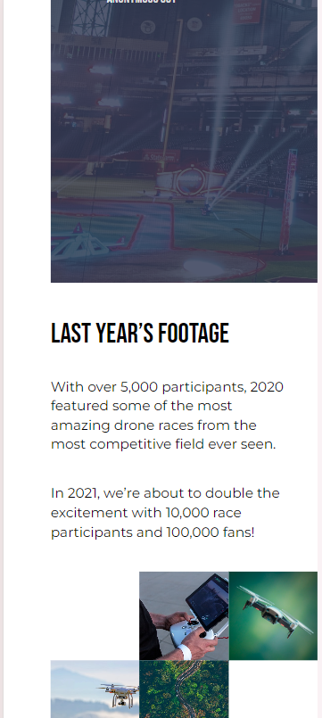

# Drone Racing Landing Page

This project was inspired by the final challenge of the [From Figma To Code](https://www.coursera.org/learn/from-figma-to-code) course on [Coursera](https://www.coursera.org/). Prior to taking the course, I built only from PDF design files. I took the course to learn to build sites from Figma design files which is more typical in professional environment. The course was taught in `HTML CSS and JavaScript` but I have implemented this solution in `React-TypeScript` to enhance functionality and maintainability.

## Table of contents

- [Overview](#overview)
  - [The challenge](#the-challenge)
  - [My additional features](#my-additional-features)
  - [Solution screenshots](#solution-screenshots)
  - [Links](#links)
- [My process](#my-process)
  - [Built with](#built-with)
  - [What I learned](#what-i-learned)
  - [Continued development](#continued-development)
  - [Useful resources](#useful-resources)
- [Author](#author)

## Overview

### The challenge

I was required to build a responsive webpage from this given [Figma file](https://www.figma.com/design/Z3lglo2FLnwFAbHVnvw1cm/Drones?node-id=1-2&t=sMjTbSFgbaaUtx8G-0)

Users should be able to:

- View the optimal layout for the site depending on their device's screen size
- See hover states for all interactive elements on the page

### My additional features

- I implemented the solution in `React-TypeScript`, even though the course was taught in `HTML, CSS, and JavaScript`, to enhance functionality and maintainability.
- I implemented a cool animation for the drone image in the 'hero' section.
- I implemented `client-side form validation` for the email signup section.
  - On submission, user receives error message with error icon if any input field is empty.
  - User receives error message if email is not formatted correctly.

### Solution screenshots

**Mobile screen - nav toggle on:**  


**Mobile screen - nav toggle off:**  
  
  


**Desktop screen:**  
  
  
  


### Links

- [GitHub Repository](https://github.com/ArinzeGit/Drone-Racing-Landing-Page)
- [Live Site URL](https://arinzegit.github.io/Drone-Racing-Landing-Page/)

## My process

### Built with

- Semantic HTML5 markup
- CSS custom properties
- CSS Modules
- [Flexbox](https://www.w3.org/TR/css-flexbox-1/) - CSS web layout model
- CSS grid - CSS web layout model
- [TypeScript](https://www.typescriptlang.org/) - Programming language that extends JavaScript
- [React](https://react.dev/) - JavaScript library
- [Node.js](https://nodejs.org/) - JavaScript runtime environment
- [Vite](https://vitejs.dev/) - React build tool with local development server

### What I learned

- I learned a more advanced way of using `CSS Grid`. I learned that I could define `grid template areas` and assign specific content to them giving me more control over layout and design. I applied this in the 'Footage' section of the page to realise the layout of the gallery of images.

```css
.gallery {
  display: grid;
  grid-template-areas:
    ". a b"
    "c d ."
    ". e .";

  @media (min-width: 900px) {
    width: min(100% - 18.274rem, 73.18%);
    /* to remember how you came about it add the two values to the two values of the width of .text-container
        You'll get 100%+4.851rem in both cases cuz they are to sit side by side with 2rem between and overflow by 6.851rem*/
    margin-left: auto;
    transform: translateY(-16.667%);
  }
}

.gallery img:nth-of-type(1) {
  grid-area: a;
}

.gallery img:nth-of-type(2) {
  grid-area: b;
}

.gallery img:nth-of-type(3) {
  grid-area: c;
}

.gallery img:nth-of-type(4) {
  grid-area: d;
}

.gallery img:nth-of-type(5) {
  grid-area: e;
}

.gallery img {
  object-fit: cover;
  aspect-ratio: 1 / 1;
}
```

- I learned more advanced ways of manupulating `background-image`. I learned that I could blend an image with a specific color by setting the solid color as background of the element, then creating a `::before` psedo-element with the image as background to sit over the original element. Then, I apply an opacity to the pseudo-element such that the solid `background-color` beneath seeps through. I needed this to realize the design of the 'Quote' section.

```css
.quote-section {
  text-transform: uppercase;
  font-family: CustomHeadingFont;
  padding: 3.813rem 0 22.75rem;
  color: #ffffff;
  background-color: #303853;
  position: relative;

  @media (min-width: 900px) {
    padding: 15.563rem 0 15.375rem;
  }
}

.quote-section::before {
  content: "";
  position: absolute;
  top: 0;
  left: 0;
  background-image: url(../assets/img/stadium.png);
  background-size: cover;
  background-position: 8%;
  width: 100%;
  height: 100%;
  opacity: 17%;
}
```

- I also learned about the `background-blend-mode` property which is used to blend various background layers of an element. I learned that setting it to 'screen' makes the `background-image` lighter and setting it to 'multiply' darkens the image. There are alot of other values which I have to study later but I used `background-blend-mode:screen` to implement the design of the 'Hero' section.

```css
.hero {
  background-color: #b2dd9e;
  background-image: url(../assets/img/speed-trails.png);
  background-size: cover;
  background-position: center;
  position: relative;
  padding: 8.25rem 0 6.688rem;
  background-blend-mode: screen;

  @media (min-width: 900px) {
    padding: 26.688rem 0;
  }
}
```

- I learned how to apply animations using CSS by defining an animation in `keyframes`. I used this to animate the drone image in 'Hero'section, to appear to hover up and down, and for the shadow to get darker when the drone is closer to the ground and lighter when drone goes up.

```css
.drone {
  position: relative;
}

.drone-body {
  position: relative;
  animation: hover 2s alternate-reverse infinite;
}

.drone-shadow {
  position: absolute;
  left: 0;
  top: 10%;
  opacity: 0.4;
  animation: pulse 2s alternate-reverse infinite;
}

@keyframes hover {
  from {
    transform: translateY(-30px);
  }
}

@keyframes pulse {
  from {
    opacity: 0;
  }
}

/* remember you can also define the "to" which uses the normal set state of the properties if not set(e.g opacity:.4 in this case).
 You can also use percentages like "0%"" for "from" and "100%"" for 'to'. You can even add intermediaries like 50%
Also know that "pulse" and "hover" are not keywords. You can use any word and define it */
```

- I found a good use case for the `clamp` CSS feature in my menu bar positioning (desktop version). I was able to make my menu bar static within a certain screen-size range, then move responsively within another range, and then stay static again within a third range using the `clamp` feature. Also, since font size can use the `vw` unit and `clamp`can take three values, I am able to declare font sizes for three ranges of viewport widths without a media query. Having delved deep into the capabilities of `clamp`, I am now able to implement dynamic and responsive behaviours that would have otherwise needed multiple media query breakpoints.

```css
.menu {
  position: absolute;
  top: 0;
  right: 0;
  background-color: #363b4e;
  width: clamp(200px, 447%, 300px);
  height: 100%;
  display: flex;
  flex-direction: column;
  align-items: flex-end;
  padding: 2.313rem 2.688rem;
  transition: clip-path 0.3s ease-in-out;

  @media (min-width: 900px) {
    right: auto;
    left: clamp(-240.9px, 261% - 1245.1px, -58.3px);
    /*Note: you intentionally solved for those clamp values to make sure that at breakpoint 900px, the left edge of the parent i.e ".nav" 
        pins ".menu" at exactly between REGISTER AND FAQ, then at 1100px, ".menu" is let loose and it moves relative to left edge of parent 
        until at 1300px when it is pinned again and finally at exactly between HOME and RACES to match the given 1440px desktop design*/
    background-color: transparent;
    width: auto;
    height: auto;
    flex-direction: row;
    align-items: center;
    padding: 0;
    margin-top: 1.438rem;
  }
}

.title {
  font-family: CustomHeadingFont;
  text-transform: uppercase;
  font-size: clamp(5vw, 2.25rem, 9vw); /*dynamic font size*/
  font-weight: 400;
  line-height: 0.916;
  width: 90%;
  padding: 0.806em 0 0.667em 15%;
  margin-bottom: 1.083em;

  @media (min-width: 900px) {
    display: inline-block;
    width: auto;
    font-size: 4rem;
    padding: 0.672em 0.739em 0.391em;
    padding-left: calc(20% - 6.851rem);
    margin-bottom: 0.906em;
  }
}
```

- Finally and generally, I learned to work with `Figma` design files. I have gotten familiar with reading typography, layout, and color specifications directly from Figma. I have also learnt to grab assets and text directly from the Figma design.

### Continued development

- Building from Figma designs
- Z-index
- Mobile-first CSS
- CSS Flexbox
- CSS Grid
- CSS animations
- CSS clamp feature
- Media queries

I found these techniques very useful. I will continue focusing on them in future projects to refine and perfect them.

### Useful resources

- [Controlling background-images | CSS Tutorial](https://youtu.be/3T_Jy1CqH9k?si=ZgKn4hLRc2OQ8m43)
- [Background images with HTML & CSS](https://youtu.be/zHZRFwWQt2w?si=TcOx42xrskKVS_oU)
- [min(), max(), and clamp() are CSS magic!](https://youtu.be/U9VF-4euyRo?si=Y_CjEqJJLmB-lb_9)
- [Solve your z-index issues | z-index and stacking context explained](https://youtu.be/uS8l4YRXbaw?si=Kv0DlGPizMolooHZ)
- [Blend background images and colors with CSS | #shorts](https://youtube.com/shorts/HwDyNRkJZLQ?si=ejlrhsf_n03CkDnW)
- [How to use mix-blend-mode, and how to avoid problems with it](https://youtu.be/TAA89nkEuhw?si=pO3YsLkEV3IuDawM)

These YouTube tutorials were really helpful and I recommend them to anyone learning these concepts.

## Author

- GitHub - [@ArinzeGit](https://github.com/ArinzeGit)
- Frontend Mentor - [@ArinzeGit](https://www.frontendmentor.io/profile/ArinzeGit)
- LinkedIn - [@Dennings-Owoh](https://www.linkedin.com/in/dennings-owoh-4839971b1/)
- Instagram - [@\_.arinze.\_](https://www.instagram.com/_.arinze._/)
- Twitter - [@Arinze98433402](https://twitter.com/Arinze98433402)
